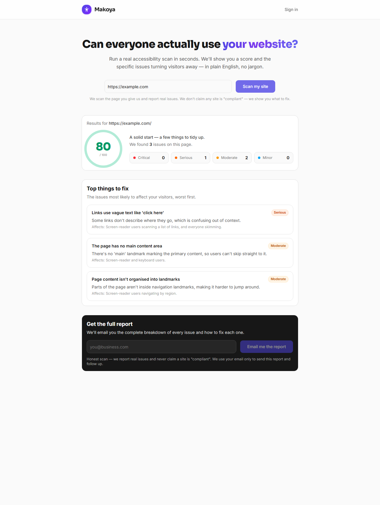
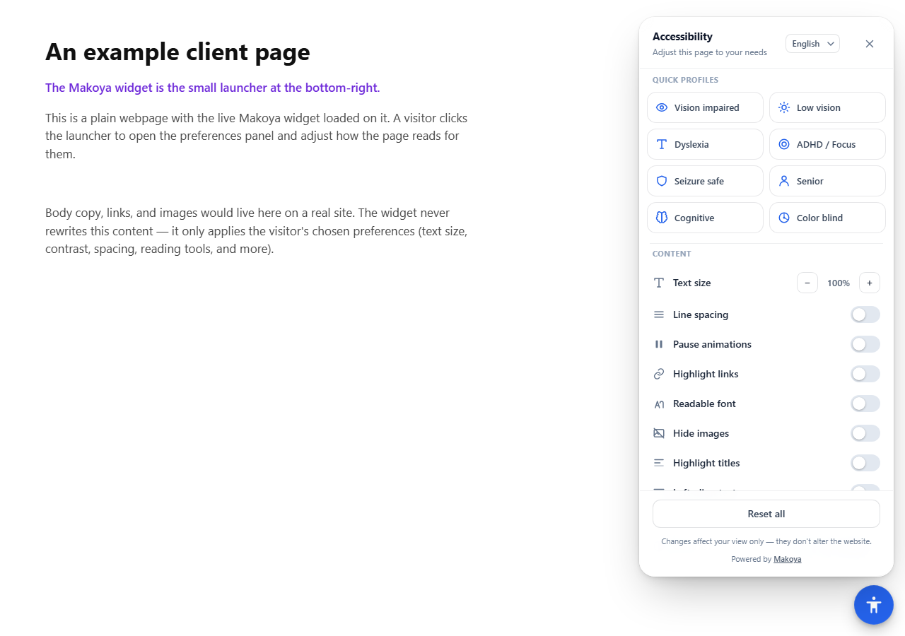
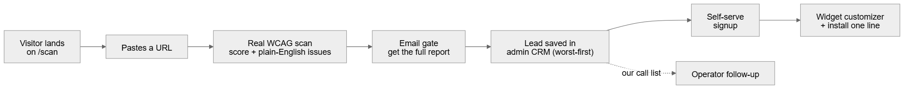
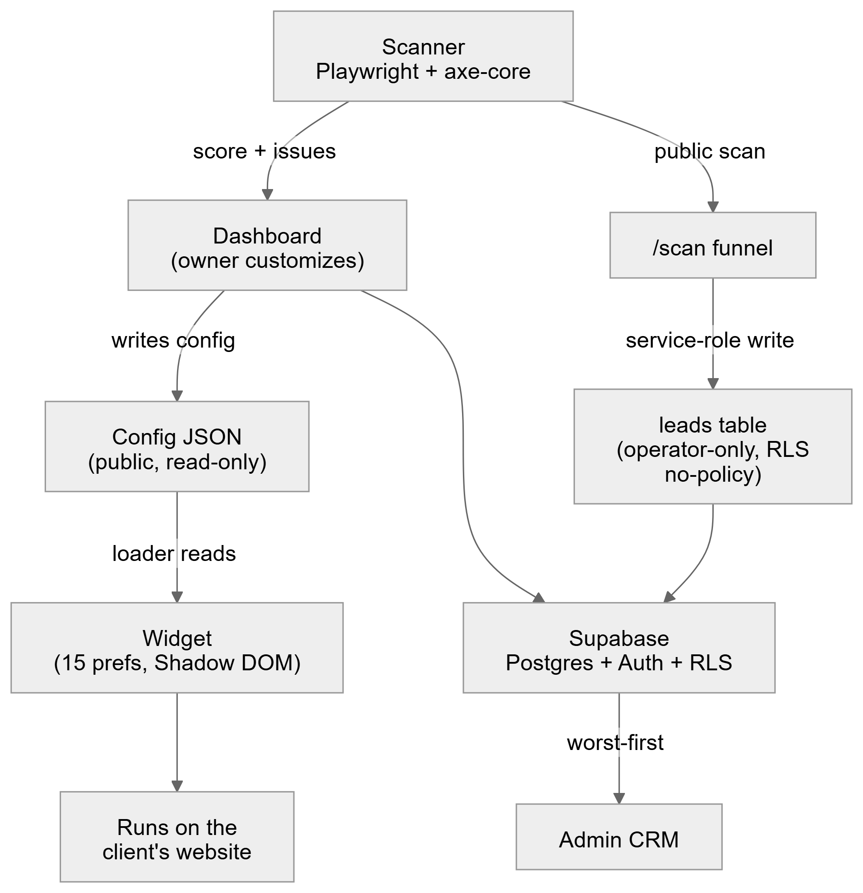

# 1. What Makoya is

**Makoya helps small and mid-size businesses make their websites usable by everyone — honestly.** It is one platform with three surfaces: a **scanner** that finds real accessibility problems and explains them in plain English, a **widget** that gives visitors genuine usability controls (bigger text, more contrast, reading tools, and more), and a **dashboard + admin** where a site owner customizes their widget and we (the operator) manage every customer and sales lead. The scanner is both the product's core value and the front door of our sales funnel.

**The bet — the honest hybrid.** The cheap "paste one line of code and you're compliant" overlay market is collapsing, and we win by being the honest alternative. The evidence is hard to argue with:

> - The U.S. **FTC fined AccessiBe \$1,000,000** (final order, April 2025) for falsely claiming its automated tool made sites compliant — and is now legally barred from making those claims.
> - Overlays do not stop lawsuits. **22.6% of all H1-2025 web-accessibility lawsuits hit sites that already had an overlay installed.**
> - Disabled users themselves reject these tools: a WebAIM survey found **72% of respondents with disabilities** rate overlays "not at all / not very effective."

Makoya never claims to make a site "compliant." We find the real problems, explain them, help fix them at the source, monitor them over time, and offer a widget that is a useful convenience — never a lie about what it does. **That honesty line is the whole position: it is the line every overlay competitor crosses, and the line we do not.**

\newpage

# 2. How it looks and feels

Everything below is a **real screenshot of the live product** at `makoya-gamma.vercel.app`.

## The public scanner — a real score, in plain English

A visitor pastes any URL. We load the page in a real browser, check it against WCAG rules, and return a score out of 100 with the issues that actually matter, worst-first, in plain language. No jargon, no fake "NOT COMPLIANT" scare screen.

Notice the honesty built into the copy itself: *"We report real issues and never claim a site is 'compliant'."* This is a live scan of `example.com` — a real 80/100, 3 genuine issues, each one explained in a sentence anyone can act on.

## The widget — 15 preferences, 9 profiles, 4 languages, one-click dismiss

The widget is a small launcher a client adds to their site. A visitor opens a clean panel and adjusts how the page reads for them: text size, line spacing, pause animations, highlight links, readable font, hide images, and more — **15 preferences in total**, grouped under **9 one-tap profiles** (low vision, dyslexia, ADHD/focus, seizure-safe, senior, color-blind, and more), in **4 languages**.

The honest line, again, is right in the panel footer: **"Changes affect your view only — they don't alter the website."** The widget never auto-detects a visitor's screen reader, never claims to "fix" the site, and closes in one click. That restraint is exactly what overlay competitors get sued over.

\newpage

# 3. How it's used — three points of view

**The website visitor (uses the widget).** Sees a small launcher, opens the panel, picks a profile or individual preferences, and the page adapts to them. No tracking of their assistive tech, no claims, dismissed in one click.

**The site owner / buyer.** Finds us, scans their site, gets a real score and a report, signs up, and lands straight in a live widget customizer with preview. They install one line of code once. Later they get monitoring alerts when a deploy breaks something, and an offer of AI-assisted (human-confirmed) fixes.

**The operator — us (the admin CRM).** Opens the admin, where customers and leads are sorted worst-score-first. The worst-scoring unpaid leads *are* the call list. **The product generates its own qualified sales pipeline.**

\newpage

# 4. What's done vs what's remaining

The hard, expensive parts are **built, deployed, and verified live**. What remains is mostly wiring third-party accounts (email, billing, analytics) and a few additive features.

| ✅ Done and live | 🔶 Remaining |
| --- | --- |
| **Widget** — 15 preferences, 9 profiles, 4 languages, Shadow DOM, one-click dismiss | **Resend email** — swap the report-email stub for real sending (one-file change, needs a key + domain) |
| **Scanner** — real WCAG 2.0/2.1/2.2 engine (Playwright + axe-core + 6 custom checks), plain-language issues | **PDF report export** — emailable full report (no keys needed) |
| **Auth + multi-tenant security** — real Supabase Auth, row-level security so no customer can see another's data | **Billing** — Lemon Squeezy checkout + server-side plan gating |
| **Client dashboard** — customizer-first, live preview, autosave, scan report | **Monitoring** — scheduled re-scans + "your score dropped" alerts |
| **Admin CRM** — customers and leads worst-score-first, plan management | **AI remediation** — suggested fixes (alt-text, plain-language, code), always human-confirmed |
| **The scanner → lead funnel** — public `/scan`, the public scan API (with SSRF protection + rate limiting), the private `leads` table, and the admin Leads page — **verified end-to-end live** | **Analytics + error tracking** — PostHog + Sentry (free tiers) |

**Honest caveat:** report emails are currently recorded by a stub rather than sent, so the loop is fully demonstrable today without a paid email account — swapping in the real provider is a small, isolated change.

\newpage

# 5. How to test it / live-demo it

You can run this yourself right now. No login required for the scanner.

1. Open **`https://makoya-gamma.vercel.app/scan`**.
2. Paste any public URL (e.g. `https://example.com`) and click **Scan my site**.
3. Wait ~10–30 seconds — we load the page in a real browser and check it. You'll see a **real score out of 100**, a **critical / serious / moderate / minor breakdown**, and the **top issues in plain English**, worst-first.
4. Enter an email in the **"Get the full report"** card. That captures a **lead**.
5. *(Operator step, login-gated)* Open **`/admin/leads`** to see the lead appear, sorted **worst-score first** — that list is the sales call list.

**The demo script for your manager (verbatim from the plan):**

> *"Watch — I paste a URL into our public scanner, it returns a real score and the real issues, I enter an email to get the full report, and a lead instantly appears in our admin dashboard. From there they self-serve sign up, customize the widget, and we can upsell monitoring."*

To show the **widget**: add one line of code to any page and the launcher appears — open it and toggle a profile to watch the page adapt live.

\newpage

# 6. Architecture at a glance

One clean design principle holds it together: **config flows one way** (dashboard writes → public JSON → widget reads), the **scanner is a real browser engine** (Playwright + axe-core), and the **private lead data is only ever touched by the trusted server** — never the browser. Customer data is isolated by row-level security, and the leads table is locked to operator-only access by design.

# 7. Roadmap and timeline

The near-term target is a **convincing manager demo**, then hardening for real paying customers. Running cost through the demo and early V1 stays **under \$50/month plus tiny usage**.

| Phase | What ships |
| --- | --- |
| **Demo (now)** | The scanner → lead → CRM loop is **live**. Next: real report emails (Resend), PDF report export, billing checkout in test mode, and demo polish (landing copy, "book a call", a funnel dashboard). |
| **V1 (real customers)** | Move heavy/monitoring scans onto a durable queue; scheduled re-scans + "your score dropped" alert emails; AI remediation **suggestions** (always human-confirmed); a **WordPress plugin** (the biggest small-business surface). |
| **V2 (scale)** | Agency / white-label multi-client portal; a productized human-audit service (via a partner, not payroll); deeper analytics. |
| **Enterprise (on demand)** | VPAT / accessibility-report document generation, SSO/SAML, audit logs, and a CI/CD accessibility gate for dev teams. |

**Bottom line:** the expensive engine already exists and is live. The remaining work is wiring accounts and adding revenue plumbing — and the honest positioning that makes Makoya different from the overlay market is baked into the product, the copy, and even a build test that blocks any compliance-guarantee language from shipping.
